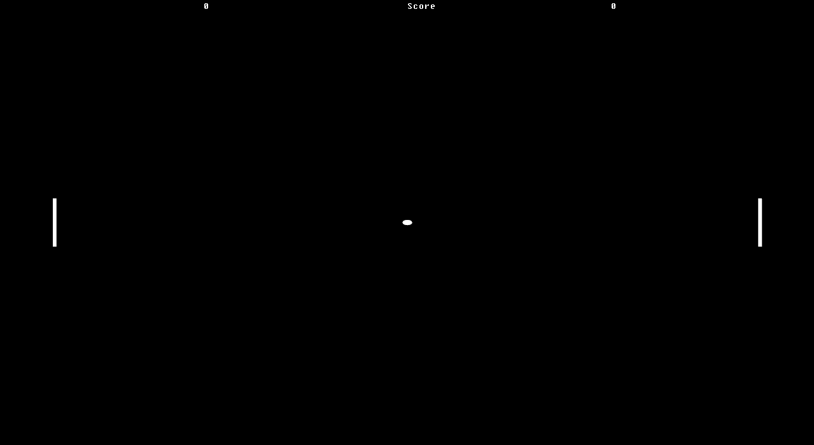
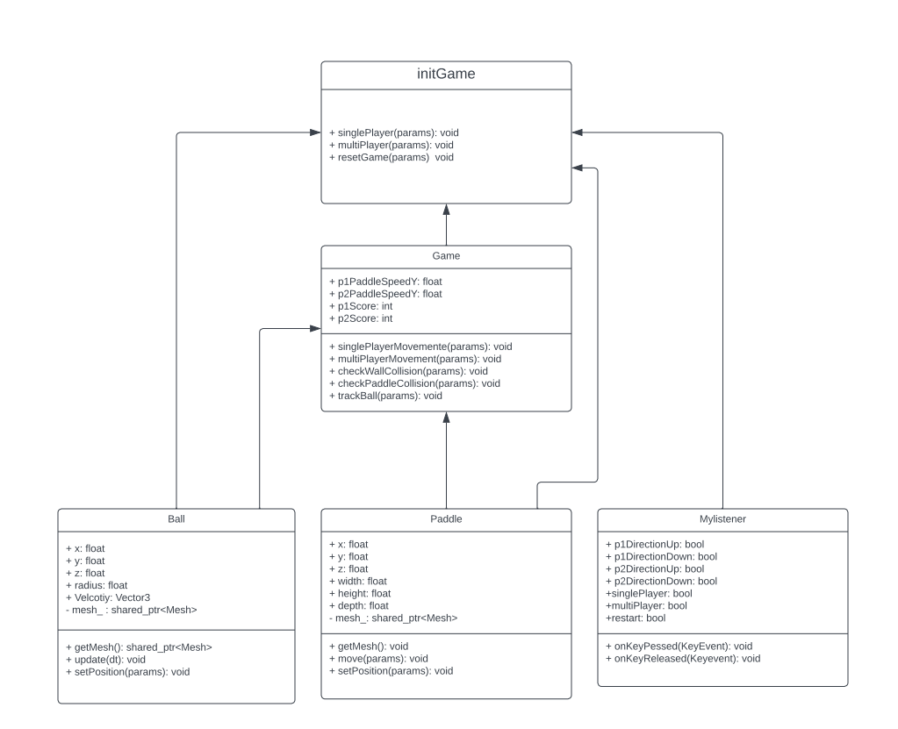

# PING PONG GAME
Kandidatnr: 10041

This is a simple implementation of the classic PingPong Game using the THREEPP library. The game can 
be played in single or multiplayer mode.

## Dependencies
This C++ program requires the Threepp library to be installed. It also uses the standard C++ libraries 
and Catch2 for unit testing

## How to Play
The game can be played in single or multiplayer mode. 
In single player mode, the player controls one paddle and the computer controls the other paddle. 
In multiplayer mode, there are two human players, each controlling their own paddle.

 
### Controls

- Player one(Left Paddle):
: W: move the paddle up
: S: move the paddle down

- Player two(Right Paddle):
: ↑ : move the paddle up
: ↓ : move the paddle down

To switch between single player and multiplayer mode, press 1 for single player and 2 for multiplayer.

To restart the game at any time, press R

## FILES
In this project we use two header files PingPongScene.hpp, PingPongGame.hpp(these files can be located in the 
include folder) and one main.cpp. 

### PingPongScene.hpp
In the PingPongScene.hpp file, we create two classes one for the "Ball" and one for the "paddle".
In the Ball class we have different functions that we use in PingPongGame.hpp.
We have one function to update the ball`s location, one function to alter the velocity of the ball, 
one function to set the position of the ball and one function to retrieve the ball object.
In the Paddle Class we have different functions that we use in PingPongGame.hpp. 
We have one function to move the ball, one function to set the position of the paddle and one function to 
retrieve the paddle object.

### PingPongGame.hpp
In the PingPongGame.hpp file, we create a class game with lots of functions that controls the game logic.
We have functions that detect collision with the walls and paddles, functions to move the paddles, one 
function to track the ball movement for single player mode. We also have four global variables, two of these variables 
are for the score and the other two variables are to move the paddle on the Y-axis accordingly to inputs.

We also have a class for KeyListener that reads user inputs that controls the paddles and can restart the game.

In addition, we create a class for initializing the PingPong game. In this class we have one function for single player 
mode, on for multiplayer mode and one last function to reset the game. We call these function in the canvas animate loop
in main.cpp

### main.cpp

In the main.cpp file, we set up the canvas, renderer, camera and set the desired parameters for these classes. 
We also create the 3D-Objects using the classes in the header-files, and create som score variables for keeping the score
In the animate function in the canvas class, we set som arguments for separating the difference between single player, 
multiplayer and reset. Which alle are part of the class initGame and can be found in PingPongGame.hpp.

## Tests

In this project we have Continuous integration(CI) and unit testing. For the unit tests we are using the Catch framework.

## UML

---
Disclaimer: This program is not necessarily completed and may have errors or omissions